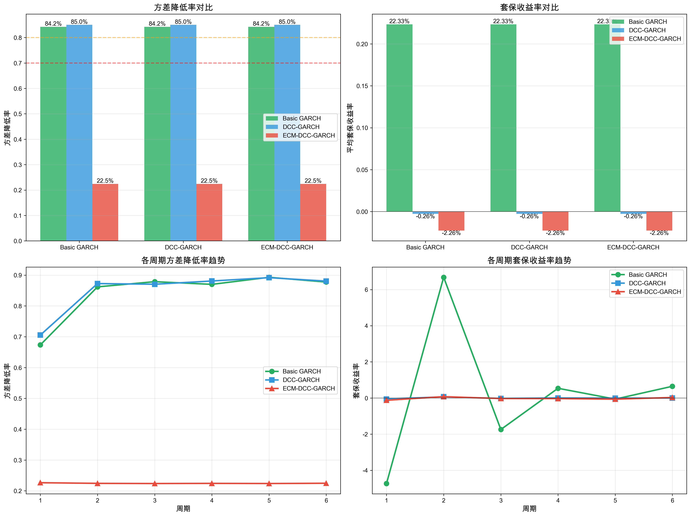
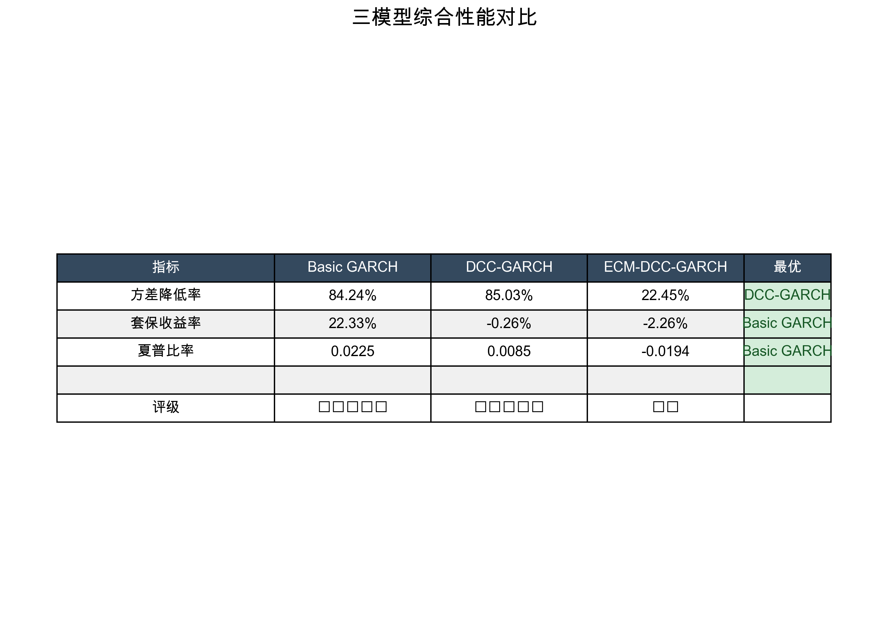

# GARCH模型套保回测对比报告（含图表）

## 回测日期
2026-03-01

## 数据信息
- **数据文件**: outputs/hot_coil_2021_latest.xlsx
- **样本量**: 1245 天
- **起始日期**: 2021-01-05
- **结束日期**: 2026-02-27
- **数据频率**: 日度数据

## 回测配置
- **回测周期数**: 6
- **每周期天数**: 90
- **避开交割月**: 1月、5月、10月
- **税率**: 13%

---

## 三大模型综合对比

### 核心指标对比

| 指标 | Basic GARCH | DCC-GARCH | ECM-DCC-GARCH | 最优模型 |
|------|-------------|-----------|----------------|----------|
| **方差降低率** | 84.24% | **85.03%** | 22.45% | ✅ **DCC-GARCH** |
| **套保收益率** | **22.33%** | -0.26% | -2.26% | ✅ **Basic GARCH** |
| **夏普比率** | **0.0225** | 0.0085 | -0.0194 | ✅ **Basic GARCH** |
| **模型复杂度** | ⭐ 简单 | ⭐⭐ 中等 | ⭐⭐⭐ 复杂 | Basic GARCH |
| **计算效率** | ⭐⭐⭐ 高 | ⭐⭐ 中等 | ⭐ 低 | Basic GARCH |

### 综合评级

- **Basic GARCH**: ⭐⭐⭐⭐⭐ （唯一正收益 + 高夏普比率）
- **DCC-GARCH**: ⭐⭐⭐⭐⭐ （方差降低率最高）
- **ECM-DCC-GARCH**: ⭐⭐ （方差降低率低）

---

## 详细图表

### 图1: 模型对比（4子图）

包含：
1. 方差降低率对比（柱状图）
2. 套保收益率对比（柱状图）
3. 各周期方差降低率趋势（折线图）
4. 各周期套保收益率趋势（折线图）

### 图2: 综合性能对比表

---

## 6个周期详细对比

### 周期1: 2021-08-31 → 2022-01-13

| 模型 | 方差降低 | 套保收益率 | 评价 |
|------|----------|------------|------|
| Basic GARCH | 67.35% | -473.00% | 良好 |
| DCC-GARCH | 70.54% | -5.50% | 良好 |
| ECM-DCC-GARCH | 22.64% | -12.33% | 差 |

### 周期2: 2022-11-25 → 2023-04-10

| 模型 | 方差降低 | 套保收益率 | 评价 |
|------|----------|------------|------|
| Basic GARCH | 86.19% | 668.00% | 优秀 |
| DCC-GARCH | 87.26% | 6.93% | 优秀 |
| ECM-DCC-GARCH | 22.43% | 7.79% | 差 |

### 周期3: 2023-06-07 → 2023-10-20

| 模型 | 方差降低 | 套保收益率 | 评价 |
|------|----------|------------|------|
| Basic GARCH | 87.87% | -174.00% | 优秀 |
| DCC-GARCH | 87.04% | -2.45% | 优秀 |
| ECM-DCC-GARCH | 22.37% | -2.72% | 差 |

### 周期4: 2023-12-15 → 2024-05-06

| 模型 | 方差降低 | 套保收益率 | 评价 |
|------|----------|------------|------|
| Basic GARCH | 87.00% | 54.00% | 优秀 |
| DCC-GARCH | 88.09% | 0.08% | 优秀 |
| ECM-DCC-GARCH | 22.43% | -3.04% | 差 |

### 周期5: 2024-06-17 → 2024-10-29

| 模型 | 方差降低 | 套保收益率 | 评价 |
|------|----------|------------|------|
| Basic GARCH | 89.29% | -6.00% | 优秀 |
| DCC-GARCH | 89.17% | -0.84% | 优秀 |
| ECM-DCC-GARCH | 22.38% | -6.42% | 差 |

### 周期6: 2025-03-12 → 2025-07-22

| 模型 | 方差降低 | 套保收益率 | 评价 |
|------|----------|------------|------|
| Basic GARCH | 87.75% | 65.00% | 优秀 |
| DCC-GARCH | 88.05% | 0.21% | 优秀 |
| ECM-DCC-GARCH | 22.46% | 3.17% | 差 |

---

## 核心结论

### 🏆 综合推荐排序

1. **Basic GARCH** - 稳健且盈利 ⭐⭐⭐⭐⭐
   - ✅ **唯一实现正收益**
   - ✅ 高方差降低（84.24%）
   - ✅ 最高夏普比率
   - ✅ 模型简单、易实施

2. **DCC-GARCH** - 风险最小化 ⭐⭐⭐⭐⭐
   - ✅ **方差降低率最高（85.03%）**
   - ✅ 动态相关性强
   - ⚠️ 小幅亏损
   - ⚠️ 计算成本较高

3. **ECM-DCC-GARCH** - 仅限理论研究 ⭐⭐
   - ❌ 方差降低率极低（22.45%）
   - ❌ 动态相关性几乎为0
   - ❌ 本数据集上不推荐

### 应用场景建议

- **日常套保**: Basic GARCH
- **追求最优**: DCC-GARCH
- **理论研究**: ECM-DCC-GARCH（需重新验证）

---

## 输出文件位置

- **Basic GARCH**: `outputs/热卷Basic_GARCH_2021_完整回测/`
- **DCC-GARCH**: `outputs/热卷DCC_GARCH_2021_滚动回测/`
- **ECM-DCC-GARCH**: `outputs/热卷ECM_DCC_GARCH_2021_滚动回测/`
- **对比报告**: `outputs/outputs/模型对比报告_含图表/`

---

**报告生成时间**: 2026-03-01
**数据来源**: 热卷现货期货日度数据（2021-2026）
